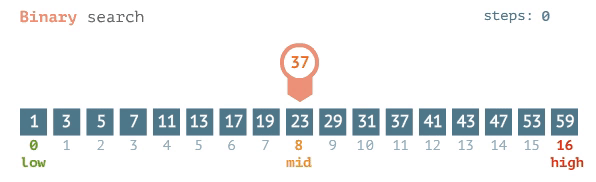
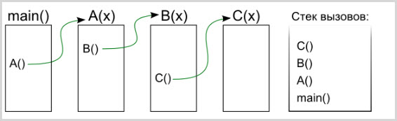
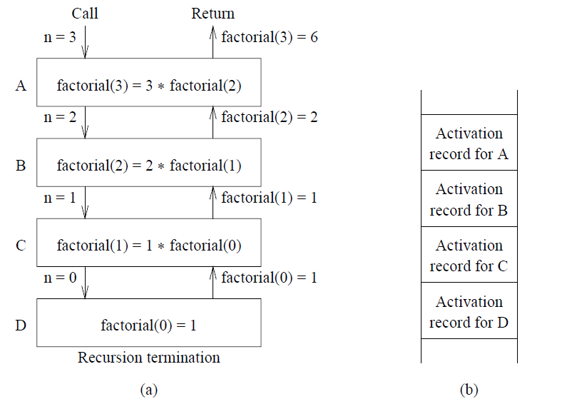

## Грокаем алгоритмы, Адитья Бхаргава (заметки)

### Бинарный поиск

**Алгоритмом** называется набор инструкций для выполнения
некоторой задачи. В принципе, любой фрагмент программного кода
можно назвать алгоритмом.

**Бинарный** поиск - алгоритм; на входе он
получает отсортированный список элементов.
Если элемент, который необходимо найти, присутствует
в списке, то бинарный поиск возвращает ту позицию, в 
которой он был найден. В противном случае
бинарный поиск возвращает *null*.

> При бинарном поиске каждый раз 
> исключается половина чисел.

> Для списка из ***n*** элементов бинарный поиск
> выполняется за ***log2(n)*** шагов, тогда
> как простой поиск будет выполнен за ***n*** шагов.

**Например**. Для списка из 8 чисел 
необходимо ***3*** итерации, поскольку ***2^3 = 8***.
Для списка из ***1024*** элементов потребуется 
10 итераций, так как ***2^10 = 1024***.

> Бинарный поиск работает только в том
> случае, если список отсортирован.

>Реализация алгоритма на **Java**:
[Binary Search](src/search/BinarySearch.java)

#### Двоичный поиск (GIF)

#### Дополнительная информация

***Линейное время*** - время, когда
максимальное количество попыток совпадает
с размером списка.

Итак, простой поиск выполняется за время
***O(n)***, а бинарный поиск - за время
***O(log n)***.

#### Примеры "O-большого"
Ниже перечислены пять разновидностей "О-большого",
которые будут встречаться особенно часто, в 
порядке убывания скорости выполнения.

  
Примеры "O-большого"

* **_O(log n)_**, или логарифмическое время. Пример:
бинарный поиск.
* _**O(n)**_, или линейное время. Пример: простой
поиск.
* _**O(n * log n)**_. Пример: эффективные алгоритмы
сортировки (быстрая сортировка).
* _**O(n^2)**_. Пример: медленные алгоритмы сортировки
(сортировка выбором).
* _**O(n!)**_. Пример: очень медленные алгоритмы (задача о коммивояжере).

#### Шпаргалка
* Скорость алгоритмов не измеряется в секундах.
* Время выполнения алгоритма описывается ***ростом***
количества операций.
* Время выполнения алгоритмов выражается как "О-большое".

### Сортировка выбором
Сортировка выбором (англ. selection sort) - простой алгоритм сортировки,
который имеет сложность ***O(n^2)***.

#### Сортировка выбором (GIF)

#### Алгоритм
На каждом ***i***-ом шаге находим
**_i_**-ый минимальный элемент и меняем его местами
с **_i_**-ым элементом в массиве. Таким образом будет 
получен массив, отсортированный по возрастанию.

#### Почему сложность алгоритма оценивается как O(n^2)?
> Ответ на данный вопрос связан с ролью констант в "О-большом".
Да, в действительности не нужно каждый раз проверять список
из **n** элементов. Сначала проверяются ***n*** элементов,
потом **_n - 1_**, **_n - 2_** ... **_2_**, **_1_**. В среднем проверяется список
из **_1/2 * n_** элементов. Его время выполнения составит **_O(n * 1/2 * n)_**. 
Однако константы (такие как **_1/2_**) в "O-большом" игнорируются, поэтому
мы просто используем **_O(n * n)_**, или **_O(n^2)_**.

#### Реализация алгоритма на Java
> [SelectionSort.java](src/selection_sort/SelectionSort.java)

### Рекурсия
_**Рекурсия**_ - метод программирования, используемый
во многих алгоритмах.  
> _**Рекурсия**_ вызывает у людей противоречивые чувства. Они либо
обожают её, либо ненавидят, либо ненавидят, пока не полюбят через
пару-тройку лет. Применение **рекурсии** не ускоряет работу программы: более того, решение
с циклами иногда работает быстрее.

Ли Колдуэлл (с сайта Stack Overflow) сказал:
> Циклы могут ускорить работу программы. Рекурсия может ускорить
> работу программиста. Выбирайте, что важнее в вашей ситуации!

#### Базовый случай и рекурсивный случай
> Каждая рекурсивная функция состоит из двух частей: базового случая
> и рекурсивного случая. В рекурсивном случае функция вызывает сама себя. В базовом
> случае функция себя не вызывает, чтобы предотвратить зацикливание.

♦ **_Рассмотрим следующую задачу._**
Написать функцию для вывода обратного отсчета.

  
Посмотреть решение задачи 

 [Countdown.java](src/recursion/countdown/Countdown.java)

#### Стек вызовов
Все это время, работая с рекурсией, мы пользовались стеком вызовов.

_**Концепция стека вызовов**_ играет важную роль
в программировании вообще; кроме того, ее важно
понимать при использовании рекурсии.

  
Реализация стека вызовов 

[Greet.java](src/recursion/callStack/greet/Greet.java)

#### Стек вызовов с рекурсией

Рекурсивные функции тоже используют стек вызовов!
Посмотрим, как это делается, на примере **_вычисления факториала_**.

  
Вычисление факториала

[Factorial.java](src/recursion/factorial/Factorial.java)

> Стек удобен, но у него есть своя цена: сохранение промежуточной 
информации может привести к значительным затратам памяти. Каждый вызов
функции занимает не много памяти, но если стек станет слишком высоким, 
это будет означать, что ваш компьютер сохраняет информацию по очень многим
вызовам. На этой стадии есть два варианта:
> * Переписать код с использованием цикла.
> * Попробовать воспользоваться так называемой **_хвостовой рекурсией_**.

