## Грокаем алгоритмы, Адитья Бхаргава (заметки) 📚 📝


### Какая польза от данного репозитория?
Данный репозиторий содержит **краткое изложение** произведения 
(**А. Бхаргава, "Грокаем алгоритмы"**). Содержимое репозитория не содержит лишней информации (на мой взгляд),
что значительно помогает в усвоении материала.
Помимо краткого изложения, репозиторий содержит анимированные изображения (GIF), алгоритмы
сортировки на Java, решения различных задач.
Надеюсь, что материал, представленный в репозитории, будет Вам полезен!

P.S. Будет здорово, если Вы оцените репозиторий, поставив "звездочку" ⭐.
Всем добра и позитива! 


### Содержание
1. [Бинарный поиск](#binary-search)
    * [Двоичный поиск (GIF)](#gif-binary-search)
    * [Дополнительная информация](#additional-info)
    * [Примеры "O-большого"](#examples)
    * [Шпаргалка](#cheat-sheet)
2. [Сортировка выбором](#selection-sort)
    * [Сортировка выбором (GIF)](#selection-sort-gif)
    * [Алгоритм](#alg-selection-sort)
    * [Почему сложность алгоритма оценивается как O(n^2)?](#question-sel-sort)
    * [Реализация алгоритма на Java](#java-selection-sort)
3. [Рекурсия](#recursion)
    * [Базовый случай и рекурсивный случай](#base-and-recursive-case)
    * [Стек вызовов](#call-stack)
    * [Стек вызовов с рекурсией](#call-stack-with-recursion)
    * [Шпаргалка](#recursion-cheat-sheet)
4. [Быстрая сортировка](#quick_sorting)
    * ["Разделяй и властвуй"](#divide_and_rule)
    * [Пара слов о функциональном программировании](#func_programming)
    * [Упражнения](#tasks)
    * [Quick Sort (реализация на Java)](#quick-sort-java)
    * [Об "О-большом"](#notation)
    * [Сортировка слиянием и быстрая сортировка](#comparison-of-sorts)
    * [Шпаргалка](#cheat-sheet-sorts)
5. [Хеш-таблицы](#hash-tables)
   * [Хеш-функция](#hash_function)
   * [Исключение дубликатов](#exclusion-of-duplicates)
   * [Коллизии](#collisions)
   * [Коэффициент заполнения](#fill-factor)
   * [Шпаргалка](#cheat-sheet-hash)
6. [Поиск в ширину](#search-in-width)
   * [Реализация графа](#graph-implementation)
   * [Реализация алгоритма](#algorithm-implementation)
   * [Время выполнения](#execution-time)
7. [Алгоритм Дейкстры](#dijkstra's-algorithm)
   * [Терминология](#terminology)
   * [Реализация](#realization)

**Алгоритмом** называется набор инструкций для выполнения
некоторой задачи. В принципе, любой фрагмент программного кода
можно назвать алгоритмом.

**Бинарный** поиск - алгоритм; на входе он
получает отсортированный список элементов.
Если элемент, который необходимо найти, присутствует
в списке, то бинарный поиск возвращает ту позицию, в 
которой он был найден. В противном случае
бинарный поиск возвращает *null*.

> При бинарном поиске каждый раз 
> исключается половина чисел.

> Для списка из ***n*** элементов бинарный поиск
> выполняется за ***log2(n)*** шагов, тогда
> как простой поиск будет выполнен за ***n*** шагов.


**Например**. Для списка из 8 чисел 
необходимо ***3*** итерации, поскольку ***2^3 = 8***.
Для списка из ***1024*** элементов потребуется 
10 итераций, так как ***2^10 = 1024***.

> Бинарный поиск работает только в том
> случае, если список отсортирован.

>Реализация алгоритма на **Java**:
[Binary Search](src/search/BinarySearch.java)

#### Двоичный поиск (GIF) <a name="gif-binary-search"></a>


#### Дополнительная информация <a name="additional-info"></a>

***Линейное время*** - время, когда
максимальное количество попыток совпадает
с размером списка.

Итак, простой поиск выполняется за время
***O(n)***, а бинарный поиск - за время
***O(log n)***.

#### Примеры "O-большого" <a name="examples"></a>
Ниже перечислены пять разновидностей "О-большого",
которые будут встречаться особенно часто, в 
порядке убывания скорости выполнения.

<details>
  <summary>Примеры "O-большого"</summary>

* **_O(log n)_**, или логарифмическое время. Пример:
бинарный поиск.
* _**O(n)**_, или линейное время. Пример: простой
поиск.
* _**O(n * log n)**_. Пример: эффективные алгоритмы
сортировки (быстрая сортировка).
* _**O(n^2)**_. Пример: медленные алгоритмы сортировки
(сортировка выбором).
* _**O(n!)**_. Пример: очень медленные алгоритмы (задача о коммивояжере).
</details>

#### Шпаргалка <a name="cheat-sheet"></a>
* Скорость алгоритмов не измеряется в секундах.
* Время выполнения алгоритма описывается ***ростом***
количества операций.
* Время выполнения алгоритмов выражается как "О-большое".

### Сортировка выбором <a name="selection-sort"></a>
Сортировка выбором (англ. selection sort) - простой алгоритм сортировки,
который имеет сложность ***O(n^2)***.

#### Сортировка выбором (GIF) <a name="selection-sort-gif"></a>


#### Алгоритм <a name="alg-selection-sort"></a>
На каждом ***i***-ом шаге находим
**_i_**-ый минимальный элемент и меняем его местами
с **_i_**-ым элементом в массиве. Таким образом будет 
получен массив, отсортированный по возрастанию.

#### Почему сложность алгоритма оценивается как O(n^2)? <a name="question-sel-sort"></a>
> Ответ на данный вопрос связан с ролью констант в "О-большом".
Да, в действительности не нужно каждый раз проверять список
из **n** элементов. Сначала проверяются ***n*** элементов,
потом **_n - 1_**, **_n - 2_** ... **_2_**, **_1_**. В среднем проверяется список
из **_1/2 * n_** элементов. Его время выполнения составит **_O(n * 1/2 * n)_**. 
Однако константы (такие как **_1/2_**) в "O-большом" игнорируются, поэтому
мы просто используем **_O(n * n)_**, или **_O(n^2)_**.

#### Реализация алгоритма на Java <a name="java-selection-sort"></a>
> [SelectionSort.java](src/selection_sort/SelectionSort.java)

### Рекурсия <a name="recursion"></a>
_**Рекурсия**_ - метод программирования, используемый
во многих алгоритмах.  
> _**Рекурсия**_ вызывает у людей противоречивые чувства. Они либо
обожают её, либо ненавидят, либо ненавидят, пока не полюбят через
пару-тройку лет. Применение **рекурсии** не ускоряет работу программы: более того, решение
с циклами иногда работает быстрее.

Ли Колдуэлл (с сайта Stack Overflow) сказал:
> Циклы могут ускорить работу программы. Рекурсия может ускорить
> работу программиста. Выбирайте, что важнее в вашей ситуации!

#### Базовый случай и рекурсивный случай <a name="base-and-recursive-case"></a>
> Каждая рекурсивная функция состоит из двух частей: базового случая
> и рекурсивного случая. В рекурсивном случае функция вызывает сама себя. В базовом
> случае функция себя не вызывает, чтобы предотвратить зацикливание.

♦ **_Рассмотрим следующую задачу._**
Написать функцию для вывода обратного отсчета.
<details>
  <summary>Посмотреть решение задачи </summary>

 [Countdown.java](src/recursion/countdown/Countdown.java)
</details>

#### Стек вызовов <a name="call-stack"></a>
Все это время, работая с рекурсией, мы пользовались стеком вызовов.

_**Концепция стека вызовов**_ играет важную роль
в программировании вообще; кроме того, ее важно
понимать при использовании рекурсии.

<details>
  <summary>Реализация стека вызовов </summary>

[Greet.java](src/recursion/callStack/greet/Greet.java)
</details>


#### Стек вызовов с рекурсией <a name="call-stack-with-recursion"></a>

Рекурсивные функции тоже используют стек вызовов!
Посмотрим, как это делается, на примере **_вычисления факториала_**.
<details>
  <summary>Вычисление факториала</summary>

[Factorial.java](src/recursion/factorial/Factorial.java)
</details>


> Стек удобен, но у него есть своя цена: сохранение промежуточной 
информации может привести к значительным затратам памяти. Каждый вызов
функции занимает не много памяти, но если стек станет слишком высоким, 
это будет означать, что ваш компьютер сохраняет информацию по очень многим
вызовам. На этой стадии есть два варианта:
> * Переписать код с использованием цикла.
> * Попробовать воспользоваться так называемой **_хвостовой рекурсией_**.

#### Шпаргалка <a name="recursion-cheat-sheet"></a>
> * Когда функция вызывает саму себя, это
> называется **рекурсией**.  
> * В каждой рекурсивной функции должно быть
> два случая: базовый и рекурсивный.
> * Стек поддерживает две операции: занесение и извлечение
> элементов.
> * Все вызовы функций сохраняются в стеке вызовов.
> * Если стек вызовов станет большим, он займет слишком много памяти.

### Быстрая сортировка <a name="quick_sorting"></a>
**Быстрая сортировка** - элегантный алгоритм сортировки, часто
применяемый на практике. Алгоритм быстрой сортировки использует
стратегию **"разделяй и властвуй"**.

>Алгоритм быстрой сортировки работает намного быстрее
**сортировки выбором**. Он является хорошим примером элегантного кода.

#### "Разделяй и властвуй" <a name="divide_and_rule"></a>
Итак, представьте, что вы **фермер, владеющий земельным участком**.
Земельный участок представлен на рисунке ниже.


Вы хотите равномерно разделить землю на одинаковые **_квадратные_**
участки. **Участки должны быть настолько большими, насколько это возможно.**

Как определить наибольший размер **_квадрата_** для участка? Воспользуйтесь
**стратегией "разделяй и властвуй"**! Алгоритмы на базе этой стратегии являются **рекурсивными**.

>Решение задачи **методом "разделяй и властвуй"** состоит из двух шагов:
>1. Сначала определяется базовый случай. Это должен быть простейший случай из всех возможных.
>2. Задача делится или сокращается до тех пор, пока не будет сведена к базовому случаю.

Для начала **разметим самые большие участки, которые можно использовать**.

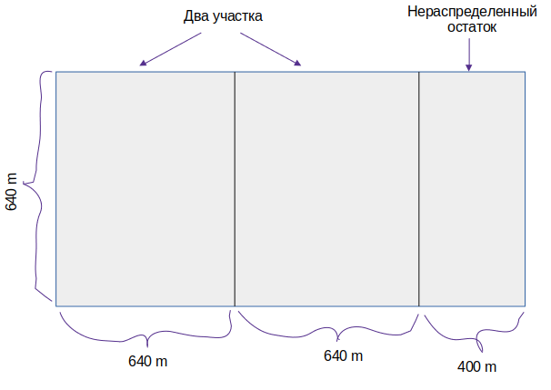

Итак, в исходном наделе можно **разместить два участка 640 х 640**, и еще **останется**
**место**. Тут-то и наступает момент истины. **_Нераспределенный остаток - это тоже надел земли,
который нужно разделить_**. То есть к нему (нераспределенному остатку) необходимо применить тот же алгоритм.

Таким образом, мы только что **сократили задачу** с размера 1680 х 640 до 640 х 400! Двигаемся дальше!

Теперь нам необходимо разделить сегмент 640 х 400. Размеры самого большого квадрата, который можно создать,
составляют 400 х 400 м (см. рисунок ниже).

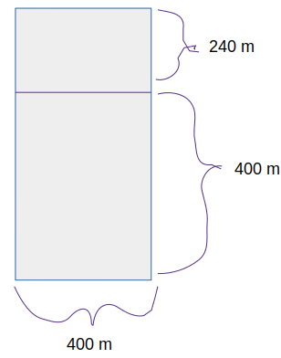

**После разделения остается меньший сегмент с размерами 400 х 240 м**. Разделим этот сегмент (см. рисунок ниже).


Отсекая поделенную часть, мы приходим к **еще меньшему размеру сегмента**, **240 х 160 м.**

После очередного отсечения получается еще **_меньший сегмент_** (см. рисунок ниже).

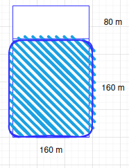

Ура, мы пришли к **базовому случаю: 160 кратно 80**. Если разбить этот сегмент
на квадраты, ничего лишнего не останется!

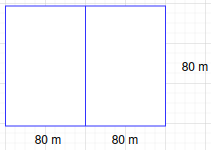

Итак, для исходного надела земли **самый большой размер** участка будет 
равен **80 х 80 м**.

> **Алгоритм Евклида**  
> "Если вы найдете самый большой участок, подходящий для этого размера, 
> это будет самый большой участок, подходящий для всей фермы." 
> 
> Если Вас интересует доказательство, поищите **_"алгоритм Евклида"_**. 

> Как работает стратегия "разделяй и властвуй":
>1. Определите простейший случай как базовый.
>2. Придумайте, как свести задачу к базовому случаю.

**_Таким образом, мы рассмотрели суть стратегии "разделяй и властвуй"._**

#### Пара слов о функциональном программировании <a name="func_programming"></a>
В языках функционального программирования, таких как Haskell,
циклов нет, поэтому для написания функций приходится 
применять рекурсию. Если вы хорошо понимаете рекурсию, вам будет проще
изучать функциональные языки.
> **Совет**
> 
> Когда вы пишете рекурсивную функцию, в которой задействован массив,
> базовым случаем часто оказывается пустой массив или массив из одного
> элемента. Если вы не знаете, с чего начать, - начните с этого.

#### Упражнения <a name="tasks"></a>
1. Имеется массив чисел. Нужно просуммировать все числа и 
вернуть сумму. Решить задачу, используя рекурсию.
> [RecursiveSum.java](src/quick_sort/RecursiveSum.java)
2. Написать рекурсивную функцию для подсчета
элементов в списке.
> [RecursiveCount.java](src/quick_sort/RecursiveCount.java)
3. Найдите наибольшее число в списке.
>[RecursiveMax.java](src/quick_sort/RecursiveMax.java)

### Quick Sort (реализация на Java) <a name="quick-sort-java"></a>
_Быстрая сортировка относится к алгоритмам сортировки.
Она работает намного быстрее сортировки выбором и часто применяется в 
реальных программах. Quick sort основана на стратегии "разделяй и властвуй"_.

**Воспользуемся быстрой сортировкой для упорядочения массива.** 

Итак, что будет являться базовым случаем?
> Пустые массивы и массивы, содержащие всего один элемент, станут базовым
случаем. Такие массивы можно просто возвращать в исходном виде - сортировать ничего не нужно.

Алгоритм быстрой сортировки работает так: сначала в массиве
выбирается элемент, который называется **_опорным_**. 

Затем определяются элементы,
**меньшие опорного**, и элементы, **большие опорного**. Этот процесс
называется **_разделением_**.

##### Подробный алгоритм быстрой сортировки


##### GIF-анимация (quick sort)

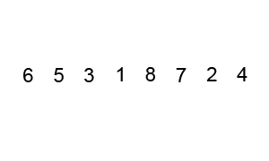

##### Программный код быстрой сортировки
> [QuickSort.java](src/quick_sort/QuickSort.java)

### Об "О-большом" <a name="notation"></a>
Алгоритм быстрой сортировки уникален тем, что его скорость
зависит от выбора опорного элемента.

В **худшем случае** быстрая сортировка работает за время **O(n^2)**. 
Ничуть не лучше сортировки выбором! Но это худший случай, а в среднем быстрая сортировка выполняется за время **O(n log n)**.

Вопросы, которые возникают: 
- что в данном случае понимается под _**"худшим"**_ и _**"средним"**_
случаем? 
- если быстрая сортировка **в среднем** выполняется за время _**O(n log n)**_, а **_сортировка слиянием_** 
выполняется за время **_O(n log n) всегда_**, то почему бы не
использовать сортировку слиянием? Разве она не быстрее?

### Сортировка слиянием и быстрая сортировка <a name="comparison-of-sorts"></a>
Попробуем выяснить, какая сортировка **работает быстрее**: сортировка слиянием или быстрая сортировка.

Допустим, у нас имеется простая функция для вывода каждого элемента в списке:
```python
def print_items(list):
   for item in list:
      print item
```
> Эта функция последовательно перебирает все элементы списка и выводит их. Так как функция перебирает весь список, она выполняется за время **O(n)**.

Изменим нашу **функцию (print_items)**, добавив секундную паузу перед выводом значения:
```python
from time import sleep
def print_items2(list):
   for item in list:
      sleep(1)
      print item
```

Работа функций продемонстрирована ниже: 
```python
# Имеется список из пяти элементов: 2|4|6|8|10
print_items: 246810
print_items2: 2 <пауза> 4 <пауза> 6 <пауза> 8 <пауза> 10 <пауза>
```
> Обе функции проходят по списку один раз, и обе выполняются за время O(n).

**Вопрос.** Какая из них работает быстрее?

**Ответ.** _print_items_ работает намного быстрее, потому что она НЕ делает паузу
перед выводом каждого элемента.

Следовательно, даже при том, что обе функции имеют **одинаковую скорость "О-большое"**, реально _print_items_ работает **быстрее**. 
Стоит понимать, когда мы используем "О-большое" (например, O(n)), в действительности это означает следующее: `c * n`. 

> Здесь `c` - некоторый фиксированный промежуток времени для алгоритма. Он называется _**константой**_. Например, время выполнения может составлять _**10 миллисекунд * n**_ для _print_items_ против _**1 секунды * n**_ для _print_items2_.

Обычно константа игнорируется, потому что если два алгоритма имеют разное время "О-большое", она роли не играет. 

Для примера возьмем бинарный и простой поиск. Допустим, что константы присутствуют в обоих алгоритмах.
```java
   10 мс * n                     1 с * log n
   __________                    ___________         
// Простой поиск             // Бинарный поиск
```
Наша реакция будет следующей: "Ого! У простого поиска константа равна 10 миллисекундам, а у бинарного поиска - 1 секунда. **Простой поиск намного быстрее!**"

Но, давайте предположим, что **поиск ведется** по списку из **4 миллиардов элементов**, тогда время будет таким:

```java
Простой поиск | 10 мс * 4 миллиарда = 463 дня (c * n, где с = 10 мс).
Бинарный поиск | 1 с * 32 = 32 секунды (с * log n, где с = 1 с). 
```
Как можем заметить, бинарный поиск все равно работает намного быстрее. Константа ни на что не повлияла. 

> Однако в некоторых случаях константа _**может**_ иметь значение. Один из примеров такого рода - быстрая сортировка и сортировка слиянием. _У быстрой сортировки константа меньше_, чем у сортировки слиянием, поэтому, несмотря на то что оба алгоритма характеризуются временем **O(n log n)**, 
быстрая сортировка работает быстрее.

#### Шпаргалка <a name="cheat-sheet-sorts"></a>

- Стратегия «разделяй и властвуй» основана на
разбиении задачи на уменьшающиеся фрагменты.
Если вы используете данную стратегию со списком, то базовым
случаем, скорее всего, будет являться
пустой массив или массив из одного
элемента.
- Если вы реализуете алгоритм быстрой сортировки, то в качестве
опорного следует выбрать случайный элемент. 
Среднее время выполнения быстрой сортировки составляет О(n log n)!
- Константы в «О-большом» иногда могут иметь значение. 
Именно по этой причине быстрая сортировка быстрее сортировки слиянием.

### Хеш-таблицы <a name="hash-tables"></a>

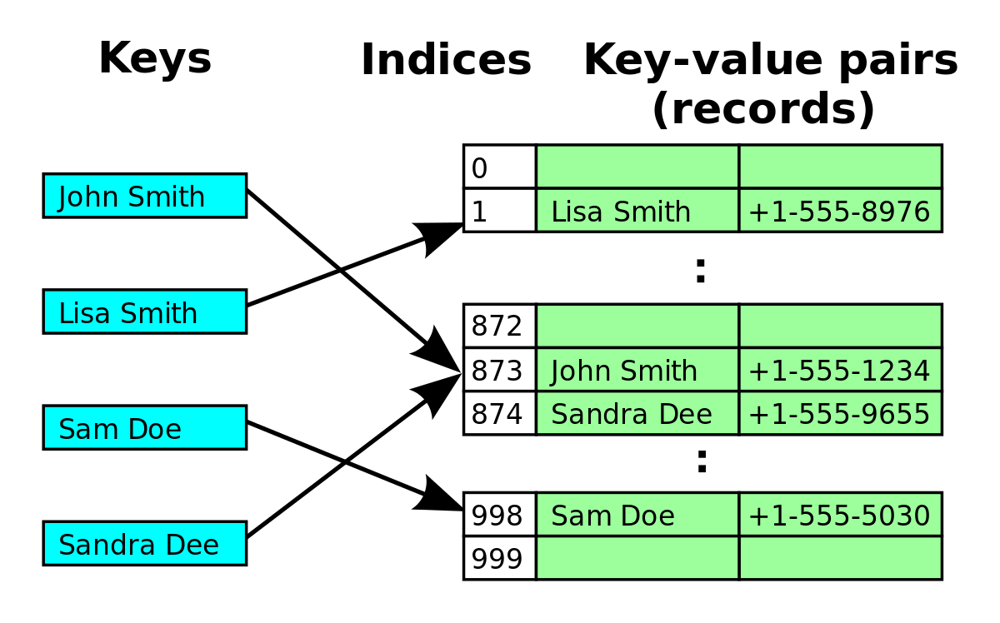

Представьте, что вы являетесь продавцом в маленьком магазинчике. 
Когда клиент покупает товары, вы проверяете их
цену по книге. Если записи в книге не упорядочены
по алфавиту, то поиск слова «апельсины» в каждой
строке займет слишком много времени.
Конечно, если же книга упорядочена по алфавиту, вы можете 
воспользоваться бинарным поиском, время которого составляет всего
O(log n).

Но поиск данных в книге - головная боль, даже если ее содержимое
отсортировано. Пока вы листаете страницы, клиент потихоньку начинает
выходить из себя. Гораздо удобнее было бы завести помощницу, которая
помнит все названия товаров и цены. Тогда ничего искать вообще не придется: 
вы спрашиваете помощницу, а она мгновенно отвечает.

**В данной ситуации отлично подойдет структура данных, которая называется хеш-таблица.**

#### Хеш-функция <a name="hash_function"></a>

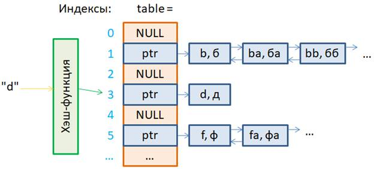

Хеш-функция представляет собой функцию, которая получает строку
и возвращает число. Под "строкой" в данном случае следует понимать любые данные.

В научной терминологии говорят, что хеш-функция «отображает строки
на числа". Можно подумать, что найти закономерности получения чисел
для подаваемых на вход строк невозможно. Однако хеш-функция должна
соответствовать некоторым требованиям:
- Она должна быть последовательной. Допустим, вы передали ей строку "апельсины" и получили 4. Это значит, что каждый раз в будущем,
  передавая ей строку «апельсины», вы будете получать 4. Без этого хеш-таблица бесполезна.
- Разным словам должны соответствовать разные числа. Например, хеш-функция, которая возвращает 1 для 
каждого полученного слова, никуда не годится. В идеале каждое входное слово должно отображаться на свое
число.

Отметим, что хеш-таблицы исключительно быстро работают!
Обращение к элементу массива происходит мгновенно, **а хеш-таблицы используют
массивы для хранения данных, поэтому при обращении к элементам они
не уступают массивам.**

В любом приличном языке существует реализация хеш-таблиц. 
Хеш-таблицы также известны под другими названиями: «ассоциативные массивы» , «словари», «отображения», «хеш-карты» 
или просто «хеши».

#### Исключение дубликатов <a name="exclusion-of-duplicates"></a>
**Задача.** Предположим, вы руководите избирательным участком. 
Естественно, каждый избиратель может проголосовать всего один раз. 
Как проверить, что он голосовал ранее? Когда человек приходит голосовать,
вы узнаете его полное имя, а затем проверяете по списку уже проголосовавших избирателей.
Если имя входит в список, значит, этот человек уже проголосовал - гоните
наглеца! В противном случае вы добавляете имя в список и разрешаете ему
проголосовать.

Но... Как быть, когда список проголосовавших станет огромным?
Неужели нужно будет каждый раз, когда кто-то приходит голосовать,  
просматривать гигантский список и проверять, голосовал он или нет?

Существует эффективное решение: **воспользоваться хешем**!

Решение задачи на Java:
> [CheckVoter.java](src/hash_tables/java/CheckVoter.java)

Решение задачи на Kotlin:
> [Check_voter.kt](src/hash_tables/kotlin/Check_voter.kt)

#### Коллизии <a name="collisions"></a>
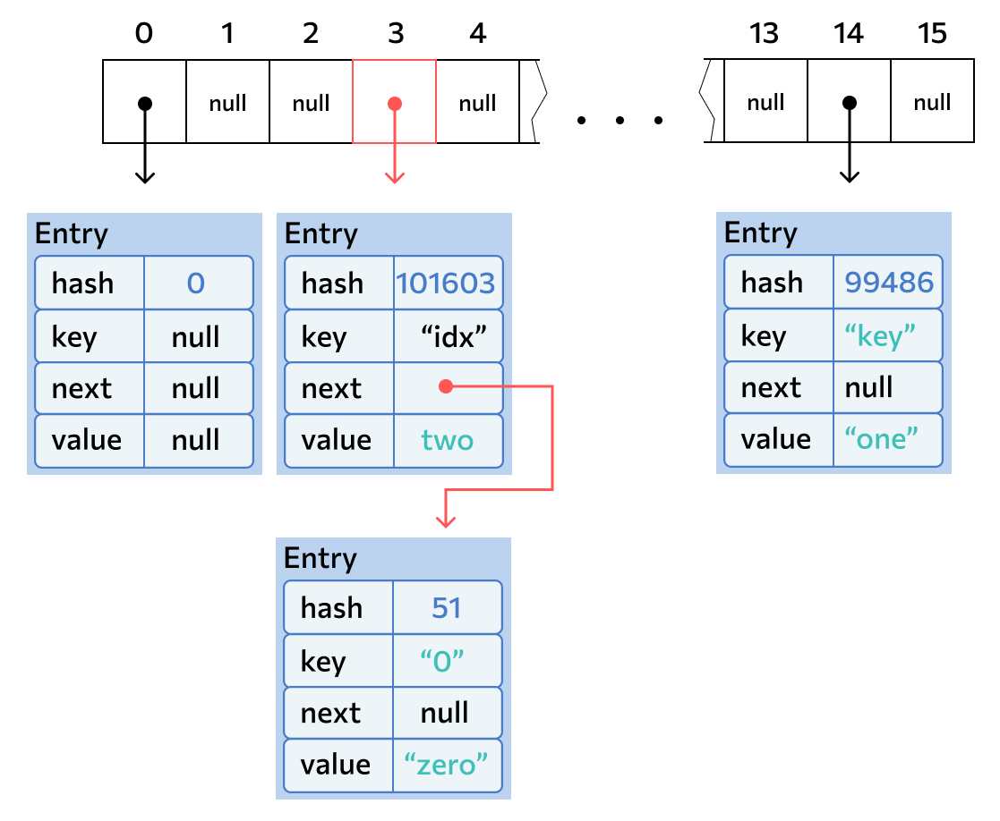

Может случиться так, 
что у двух разных ключей окажется одинаковый хэш. 
Или хэш будет разным, но по формуле позиция для обоих хэшей будет одинаковой. 
Тогда значения обоих ключей окажутся записаны в одну «корзинку». **Это и есть коллизия.** 
Именно из-за коллизий для хранения значений используется связанный список: если бы в массиве просто хранился объект, 
любая коллизия перезаписала бы текущее значение, а это опасно. А при текущей реализации, даже если случится коллизия, 
новое значение просто запишется в начало той же «корзинки», не изменив старое.

**Итак, можно сделать два вывода:**
* выбор хеш-функции действительно важен. Хеш-функция, отображающая все ключи на 
один элемент массива, никуда не годится. В идеале
хеш-функция должна распределять ключи равномерно по всему хешу;
* если связанные списки становятся слишком длинными, работа с хеш-таблицей 
сильно замедляется. Но они не станут слишком длинными _при использовании хорошей хеш-функции_!

#### Коэффициент заполнения <a name="fill-factor"></a>
Коэффициент заполнения хеш-таблицы вычисляется по простой формуле:
**количество элементов в хеш-таблице / общее количество элементов.**
Например, в следующей хеш-таблице **_коэффициент заполнения равен 3/4_**.

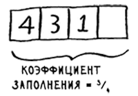

С меньшим коэффициентом загрузки число коллизий уменьшается, и ваша таблица начинает работать более эффективно. 
**_Хорошее приближенное правило: изменяйте размер хеш-таблицы, когда коэффициент заполнения превышает
0,7._** Но ведь на изменение размеров уходит много времени, скажете вы,
и будете абсолютно правы! Да, изменение размеров требует значительных затрат ресурсов, поэтому оно не должно 
происходить слишком часто.
В среднем хеш-таблицы работают за время 0(1) даже с изменением размеров.

#### Шпаргалка <a name="cheat-sheet-hash"></a>
Хеш-таблицы чрезвычайно полезны, потому что они обеспечивают высокую
скорость операций и позволяют по-разному моделировать данные.
* Хеш-таблица создается объединением хеш-функции с массивом.
* Коллизии нежелательны. Хеш-функция должна свести количество коллизий к минимуму.
* Хеш-таблицы обеспечивают очень быстрое выполнение поиска, вставки и удаления.
* Хеш-таблицы хорошо подходят для моделирования отношений между объектами.
* Как только коэффициент заполнения превышает 0,7, пора изменять размер хеш-таблицы.
* Хеш-таблицы используются для кэширования данных (например, на веб-серверах).
* Хеш-таблицы хорошо подходят для обнаружения дубликатов.

### Поиск в ширину <a name="search-in-width"></a>
Поиск в ширину позволяет найти **_кратчайшее расстояние_** между двумя объектами. 
Однако сам термин «кратчайшее расстояние» может иметь много
разных значений! Например, с помощью поиска в ширину можно:
* написать программу для игры в шашки, которая вычисляет кратчайший
  путь к победе;
* реализовать проверку правописания (минимальное количество изменений, преобразующих ошибочно 
написанное слово в правильное, например АЛГОРИФМ -> АЛГОРИТМ - одно изменение);
* найти ближайшего к вам врача.

**_Алгоритм поиска в ширину (англ. breadth-first search, BFS)_** позволяет найти кратчайшие пути из 
одной вершины невзвешенного (ориентированного или неориентированного) графа до всех остальных вершин. 
Под кратчайшим путем подразумевается путь, содержащий наименьшее число ребер.

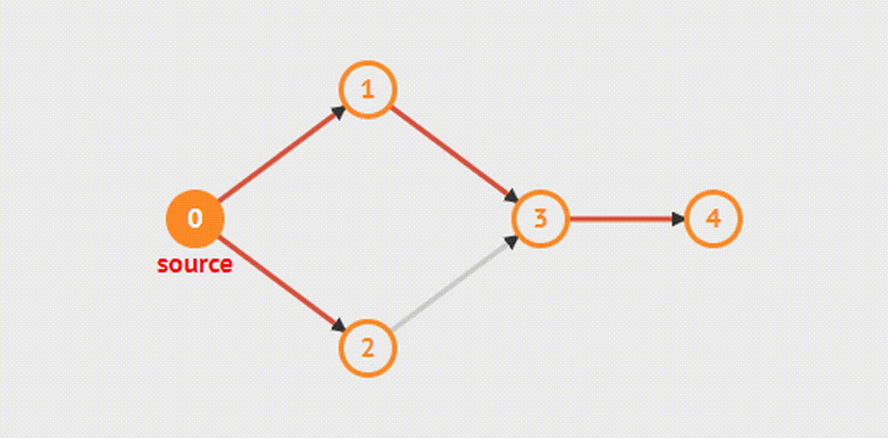

#### Реализация графа <a name="graph-implementation"></a>
_**Задание.**_ Реализовать граф (на программном уровне), который представлен на рисунке ниже.

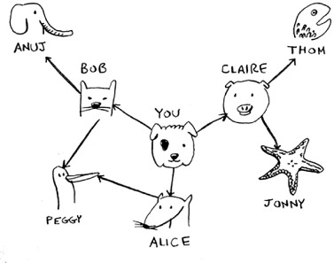

Граф состоит из нескольких узлов. И каждый узел соединяется с соседними узлами.
_**Возникает вопрос: какую структуру данных использовать, чтобы реализовать данные отношения?**_   

Будем использовать **хеш-таблицу**! 

Код на языке Java выглядит так:
```java
   private static Map<String, List<String>> graph = new HashMap<>();

   graph.put("you", Arrays.asList("alice", "bob", "claire"));
   graph.put("bob", Arrays.asList("anuj", "peggy"));
   graph.put("alice", Arrays.asList("peggy"));
   graph.put("claire", Arrays.asList("thom", "jonny"));

   // У Ануджа, Пегги, Тома и Джонни соседей нет.
   graph.put("anuj", Collections.emptyList());
   graph.put("peggy", Collections.emptyList());
   graph.put("thom", Collections.emptyList());
   graph.put("jonny", Collections.emptyList());
```
В хеш-таблицах элементы не упорядочены, поэтому добавлять пары "ключ-значение" можно
в любом порядке.

Анудж является соседом Боба, но Боб не является соседом
Ануджа. Такой граф называется **_направленным_** - отношения действуют только в одну
сторону.

#### Реализация алгоритма <a name="algorithm-implementation"></a>

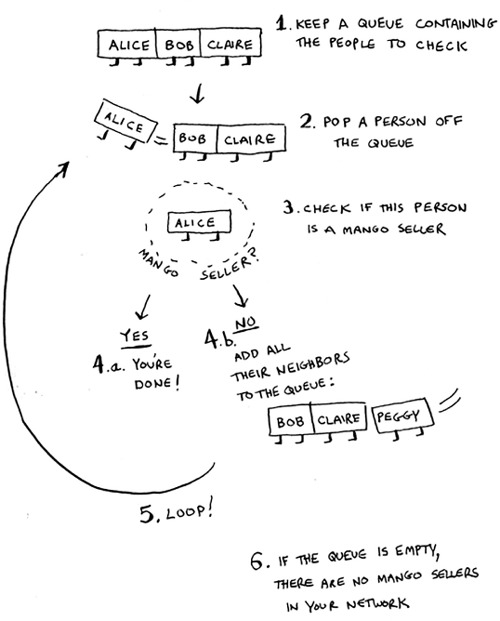

Реализация алгоритма на Java находится в [BreadthFirstSearch.java](src/breadth_first_search/java/BreadthFirstSearch.java) 

#### Время выполнения <a name="execution-time"></a>
Если поиск продавца манго был выполнен по всей сети, значит, вы прошли
по каждому ребру (напомню: ребром называется соединительная линия или
линия со стрелкой, ведущая от одного человека к другому). Таким образом,
время выполнения составляет как минимум _О(количество ребер)_.

Также в программе должна храниться очередь поиска. Добавление одного человека 
в очередь выполняется за постоянное время: _О(1)_.
Выполнение операции для каждого человека потребует суммарного времени
_О(количество людей)_. Поиск в ширину выполняется за время _О(количество
людей + количество ребер)_, что обычно записывается в форме _O(V+E)_ (V - количество вершин, 
Е - количество ребер).

### Алгоритм Дейкстры <a name="dijkstra's-algorithm"></a>


Алгоритм Дейкстры используется для поиска пути от начальной точки к конечной
за кратчайшее возможное время.

**Алгоритм Дейкстры состоит из четырех шагов:**
1. Найти узел с наименьшей стоимостью (то есть узел, до которого можно
   добраться за минимальное время).
2. Обновить стоимости соседей этого узла.
3. Повторять, пока это не будет сделано для всех узлов графа.
4. Вычислить итоговый путь.

#### Терминология <a name="terminology"></a>
Когда вы работаете с алгоритмом Дейкстры, с каждым ребром графа связывается 
число, называемое **_весом_**.
Граф с весами называется _взвешенным графом_. Граф без весов называется
_невзвешенным графом_.

В ненаправленном графе каждое новое ребро добавляет еще один цикл.
Алгоритм Дейкстры работает только с **_направленными ациклическими графами_**,
которые нередко обозначаются сокращением DAG (Directed Acyclic Graph).

Хочется отметить, что алгоритм Дейкстры не может использоваться при наличии ребер, 
имеющих отрицательный вес. Такие ребра нарушают работу алгоритма.

#### Реализация <a name="realization"></a>
Посмотрим, как алгоритм Дейкстры реализуется в программном коде. Ниже
изображен граф, который будет использоваться в этом примере.

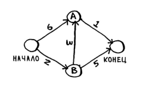

Реализация алгоритма на языке Java 
представлена в [DijkstraAlgorithm.java](src/dijkstras_algorithm/DijkstraAlgorithm.java)